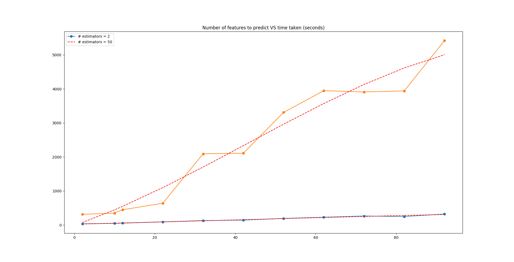

# GAME benchmarks

> This is just a test file to contain some benchmarks of the main algorithm

## Table of content

- [tl;dr](#tldr)
- [Inputs](#inputs)
- [Setup](#setup)
- [Ouputs](#outputs)

## TL;DR
```
linear trend on the number of features (using 1 model)
```

## Inputs
Inputs have been generated with the [provided script](create_benchmark_inputs.py): for each size, the script samples random features from the [allowed ones](/library/library_labels.dat), and generates random numbers from a uniform distribution (with default `min, max = 1e-9, 1e9`)

## Setup
```bash
python2 create_benchmark_inputs.py
python2 run_benchmarks.py
```
Using the default regressor with `n_estimators = 2`, with just 2 processes under linux (with 8-cores and 16GB RAM) it should take the [following times](#outputs).

## Outputs
A sample of the raw output:
```
→ python2 run_benchmarks.py    
Running test with 10 features
Model 1/1 completed...
Tried to write results to file but got error:
[Errno 20] Not a directory: '/dev/null/model_ids.dat'
Successfully completed test with 10 features
        Time taken: 46.9975318909 seconds

Running test with 72 features
Model 1/1 completed...
Tried to write results to file but got error:
[Errno 20] Not a directory: '/dev/null/model_ids.dat'
Successfully completed test with 72 features
        Time taken: 264.147193193 seconds

Running test with 32 features
Model 1/1 completed...

...

Done all tests, displaying chart...
```

yielding a table like

| Number of features | Time taken (`n_estimators = 2`) | Time taken (`n_estimators = 50`) |
| --- | --- | --- |
| `2` | `34.3053150177` | `311.526357889`
| `10` | `46.9975318909` | `349.867633104`
| `12` | `53.5937390327` | `446.740544081`
| `22` | `91.2368578911` | `638.751111984`
| `32` | `129.276766062` | `2091.38997006`
| `42` | `142.909941912` | `2108.95538092`
| `52` | `192.220395088` | `3307.15612292`
| `62` | `227.963886976` | `3948.45627499`
| `72` | `264.147193193` | `3909.95674992`
| `82` | `247.914298058` | `3940.96902299`
| `92` | `321.900949001` | `5418.64426994`

which shows a trend like

